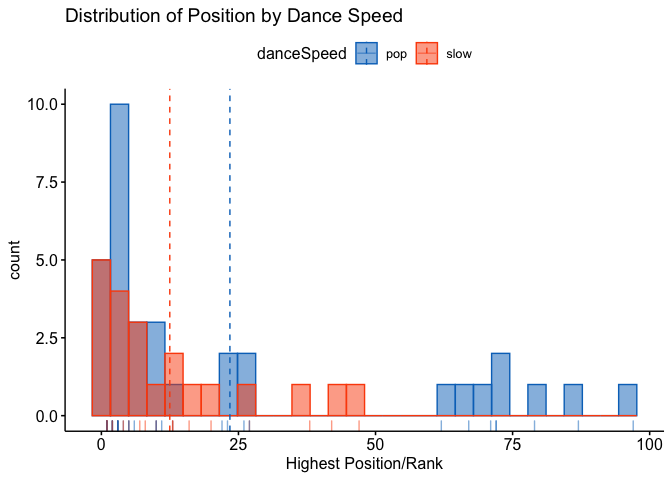
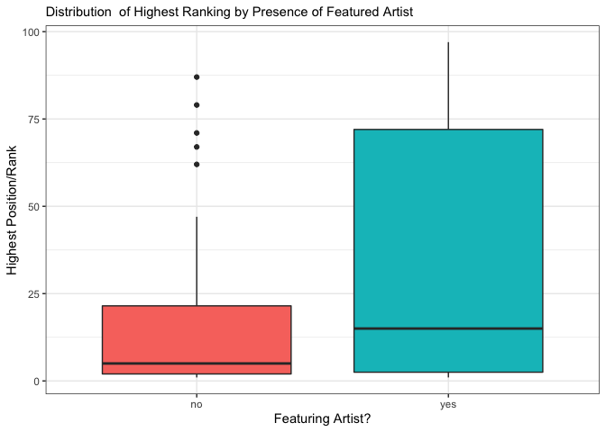
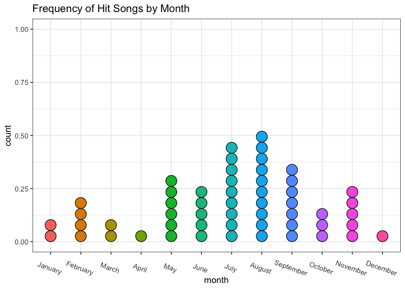
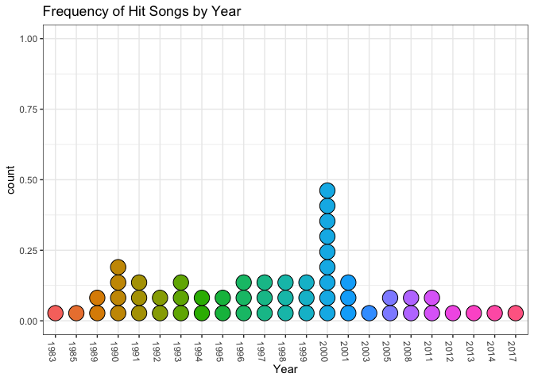
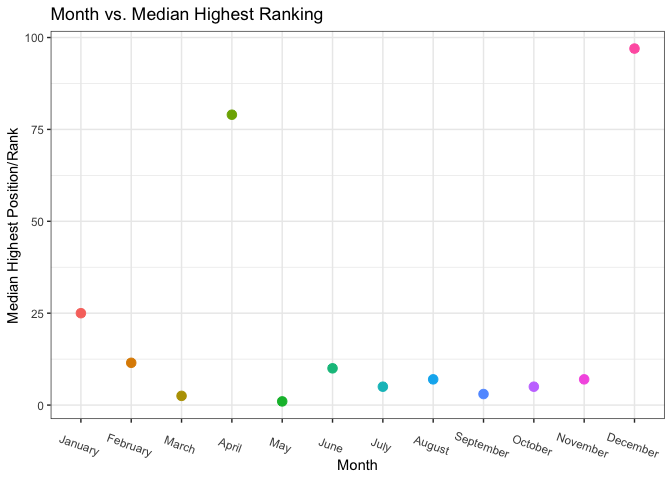
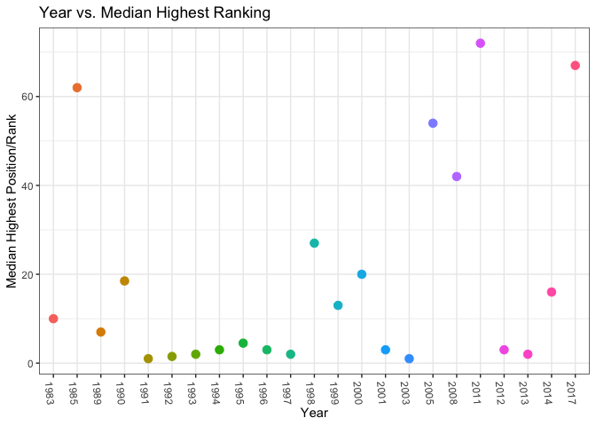

<!-- README.md is generated from README.Rmd. Please edit that file -->

# BoyBands

<!-- badges: start -->

<!-- badges: end -->

The ‘BoyBands’ package has a dataset called ‘BoyBands’ which contains an
audio-visual history of 55 boybands that had at least 1 song on the US
version of the Billboard Hot 100 between 1983 - 2017.

## Installation

You can install the released version of BoyBands from
[CRAN](https://CRAN.R-project.org) with:

``` r
install.packages("BoyBands")
```

# Analysis

First, let’s read the Bands dataset into the Rmd.

``` r
BoyBands
#> # A tibble: 55 x 7
#>    band           highest_pos danceSpeed featuring_artist  year month      day
#>    <chr>                <dbl> <chr>      <fct>            <dbl> <fct>    <dbl>
#>  1 IMx                     23 pop        no                2000 January      8
#>  2 Nu Flavor               27 slow       no                1998 January     31
#>  3 B2K                      1 pop        yes               2003 February     1
#>  4 Guys Next Door          42 slow       no                1991 February    23
#>  5 Musical Youth           10 pop        no                1983 February    26
#>  6 The Boys                13 pop        no                1989 February    25
#>  7 Soul for Real            2 pop        no                1995 March       18
#>  8 The Wanted               3 pop        no                2012 March       31
#>  9 Day26                   79 pop        no                2008 April       12
#> 10 All-4-One                1 slow       no                1994 May         21
#> # … with 45 more rows
```

Here are the questions that we want to answer in the analysis.

## a) Do pop or slow songs tend to do better on the charts?

To answer this question, we’ll look at the distribution of highest
ranked songs by ‘dance\_speed’ which characterizes songs into either
pop/upbeat or slow.

SOLUTION:

``` r
# tally the number of slow and pop songs in dataset
tally(~ BoyBands$danceSpeed, format = "perc")
#> BoyBands$danceSpeed
#>      pop     slow 
#> 61.81818 38.18182


gghistogram(BoyBands, x = "highest_pos", add = "mean", rug = TRUE, 
            color = "danceSpeed", fill = "danceSpeed",
             palette = c("#0073C2FF", "#FC4E07"),
            xlab = "Highest Position/Rank",
            title = "Distribution of Position by Dance Speed")
```



The histogram above shows that pop songs have a higher-centered
distribution of rankings. The vertical lines represent the means of each
distribution. Remember that the lower  the rank, the better (e.x.
position 1 is better than position 6) . So on average, slow songs are
higher ranked than pop songs. However, it’s important to note that 61.8%
of the songs are pop and only 38.2% of the songs are slow so there is a
preference for pop songs to be ranked in the top 100 at all as oppose to
slow songs.

## b) Is there an association between having a featured artist and highest position on the chart?

For this question, we will look at the distribution of highest ranked
songs by ‘featuring\_artist’ which assesses whether or not another
artist was present on the band’s most popular track.

SOLUTION:

``` r
tally( ~ featuring_artist, data = BoyBands, format = "perc")
#> featuring_artist
#>       no      yes 
#> 85.45455 14.54545

ggplot(BoyBands,
  aes(x = featuring_artist, y = highest_pos, fill = featuring_artist)) +
  geom_boxplot() +
  theme_bw() +
  labs(x = "Featuring Artist?", y = "Highest Position/Rank", 
       title = "Distribution  of Highest Ranking by Presence of Featured Artist") +
  theme(legend.position = "none") +
  theme(plot.title = element_text(size = 11))
```



We see from the side-by-side boxplot of the distribution of highest
ranking by having a featured artist or not, that tracks that had a
featured artist generally had lower rankings (higher numbered positions)
than tracks that did not feature an external artist.

It is also important to note here that only 14.5% of the songs in the
dataset had a featured artist. There’s not much representation for songs
with features on them, so we can also draw that mostly songs with no
featuring artist ranked on the charts at all.

## c) Which month and year debuted the most hit songs?

To answer this question, we will look at dot plots counting the number
of songs debuted in each month, and then for each year separately.

``` r
BoyBands$month <- factor(BoyBands$month ,levels = month.name)
ggplot(BoyBands, aes(x = month, fill = month)) + 
  geom_dotplot() + 
  theme_bw() + 
  theme(legend.position = "none") + 
  labs(title = "Frequency of Hit Songs by Month") +
   theme(axis.text.x = element_text(angle = -20))
```



August debuted the most hit songs throughout the years. It debuted 10
hit songs from boy bands with July not too far behind at 9 hit songs.
Generally, the summer time seems to be the most popular season for boy
bands.

Now we can investigate the years.

``` r
ggplot(BoyBands, aes(x = as.factor(year), fill = as.factor(year))) + geom_dotplot() + 
  theme_bw() + 
  theme(legend.position = "none") + 
  labs(title = "Frequency of Hit Songs by Year", x = "Year") +
   theme(axis.text.x = element_text(angle = -85))
```



The year of 2000 debuted the most hit songs throughout the years. Boy
band popularity seems to build up a bit, hit its peak in that year, and
then regress again in the years following.

## d) Is there an association between month and median highest position on the charts for boybands? How about for year instead of month? What months and years were the most and least successful for boybands?

To answer these questions, we will plot median highest position
vs. month and year respectively to see if we observe any trends. We
will also run correlation tests between the two variables to find the
correlations between them and whether or not they are significant.

Then, we can check the min and max medians to see which months and years
boy band songs were most and least popular.

### Months

``` r
Bands_months <- BoyBands[, c(6, 2)] %>%
  mutate(month = as.numeric((BoyBands$month)))

 Bands_months <- aggregate(Bands_months, list(Bands_months$month), median) %>%
   select(-Group.1) %>%
   mutate(month = as.factor(month.name[month]))
 
 Bands_months$month <- factor(Bands_months$month ,levels = month.name)
 
 ggplot(Bands_months, aes(x = as.factor(month),y = highest_pos, col = as.factor(month))) +
   geom_point(size = 3) +
   labs(title= "Month vs. Median Highest Ranking", 
        x = "Month", 
        y = "Median Highest Position/Rank") +
   theme_bw() +
   theme(legend.position = "none") +
   theme(axis.text.x = element_text(angle = -20))
```



``` r

Bands_months2 <- Bands_months %>%
  mutate(month = as.numeric((Bands_months$month)))
 
 # test correlation between month and highest position
  cor.test(Bands_months2$highest_pos, Bands_months2$month)
#> 
#>  Pearson's product-moment correlation
#> 
#> data:  x and y
#> t = 0.50553, df = 10, p-value = 0.6241
#> alternative hypothesis: true correlation is not equal to 0
#> 95 percent confidence interval:
#>  -0.4574886  0.6709738
#> sample estimates:
#>       cor 
#> 0.1578596

  # gives data frame with most successful month for boybands
Bands_months %>%
  filter( highest_pos == min(highest_pos))
#>   month highest_pos
#> 1   May           1

# gives data frame with least successful month for boybands
Bands_months %>%
  filter( highest_pos == max(highest_pos))
#>      month highest_pos
#> 1 December          97
```

The scatterplot above shows us that there doesn’t seem to be a
relationship between month of the year and median ranking in the charts
for boy band songs. Our correlation test confirms that theory with a
weak positive correlation of 0.16. However, based on our p-value of 0.6,
we do not have enough evidence to conclude that this correlation is
significant.

We do see, however, that May is the most popular month for boy-band
music with a median ranking of 1, and December is the least popular
month for boy bands’ music with a median ranking of 97. Although, we saw
from the dotplot in our previously answered question that only 1 song
ranked in the top 100 at all in the month of December. Winter seems to
be the least popular season for boy bands.

Now, let’s move on to years.

### Years

``` r

Bands_years <- BoyBands[, c(5, 2)]

# take the median highest position by year
 Bands_years <- aggregate(Bands_years, list(Bands_years$year), median) %>%
   select(-Group.1) %>%
   arrange(year)
 
 ggplot(Bands_years, aes(x = as.factor(year),y = highest_pos, col = as.factor(year))) + 
   geom_point(size = 3) + 
   theme_bw() + 
   theme(legend.position = "none") +
   labs(title =  "Year vs. Median Highest Ranking",
        x = "Year",
        y = "Median Highest Position/Rank") +
   theme(axis.text.x = element_text(angle = -85))
```



``` r
 
 
cor.test(Bands_years$highest_pos, Bands_years$year)
#> 
#>  Pearson's product-moment correlation
#> 
#> data:  x and y
#> t = 1.5313, df = 21, p-value = 0.1406
#> alternative hypothesis: true correlation is not equal to 0
#> 95 percent confidence interval:
#>  -0.1095842  0.6448876
#> sample estimates:
#>       cor 
#> 0.3169342
   
   
  # gives data frame with most successful year for boybands
Bands_years %>%
  filter( highest_pos == min(highest_pos))
#>   year highest_pos
#> 1 1991           1
#> 2 2003           1

# gives data frame with least successful year for boybands
Bands_years %>%
  filter( highest_pos == max(highest_pos))
#>   year highest_pos
#> 1 2011          72
```

The scatterplot above shows us that there doesn’t seem to be a strong
relationship between year and median ranking in the charts for boy band
songs (perhaps a minuscule positive association). Our correlation test
confirms that with a weak positive correlation of 0.3. Based on our
p-value of 0.1, we do not have enough evidence to conclude that this
correlation is significant. The relationship is stronger with years than
with months, though.

1991 and 2003 were the most popular years for boy-band music with median
rankings of 1, and 2011 is the least popular month for boy bands’ music
with a median ranking of 72. We can also note here for more context that
2003 only had 1 data point so that song was top ranked for the year.
